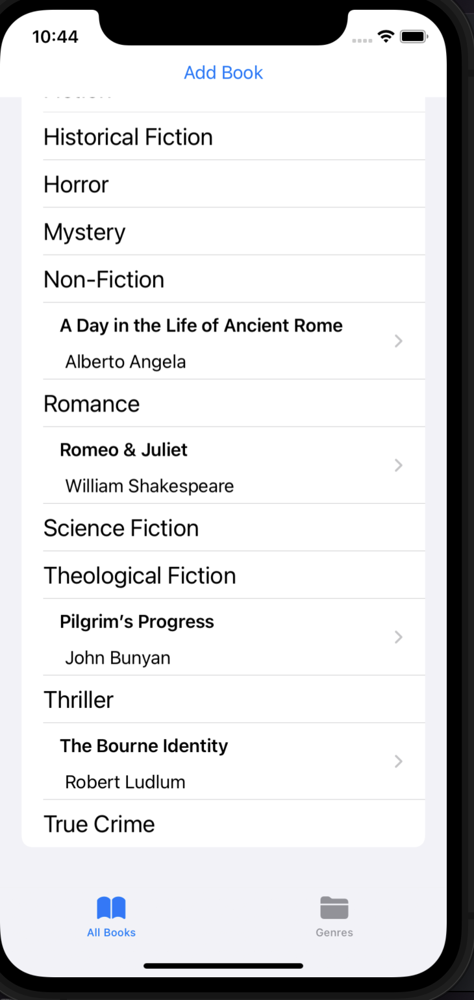
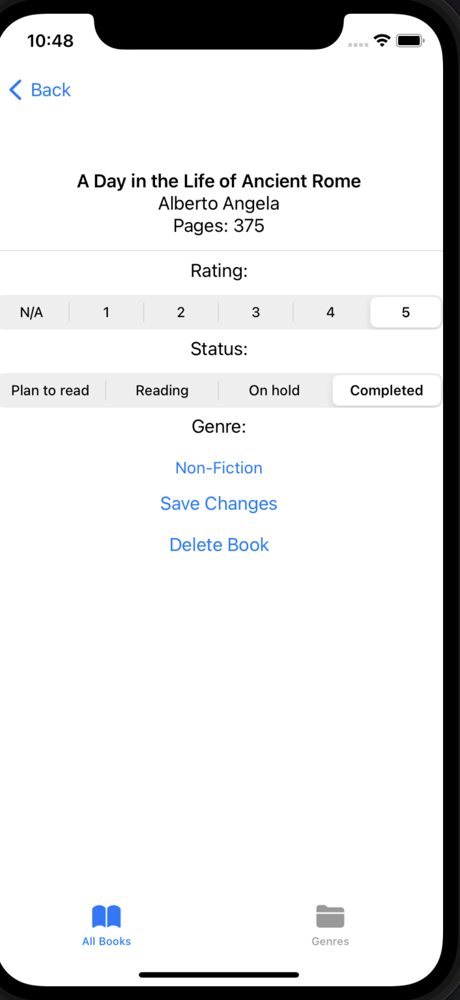
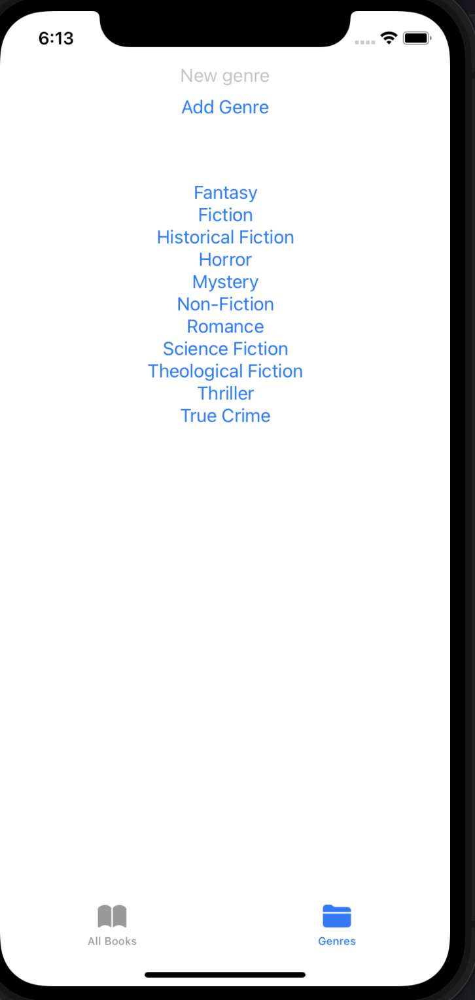

# Reading List App
This demo app solves the iOS Databases Module 1 challenge from https://codewithchris.com. 

It tracks the books to read/ have been read, or are going to be read. It shows how you can 
use the `FirebaseFirestoreSwift` package in order to quickly map Swift objects to Firebase documents. This drastically saves the 
amount of code needed to create or update documents.

This project/ code was heavily influenced by Peter Frie's excellent article: https://peterfriese.dev/swiftui-firebase-codable/.

# Normal Firebase vs FirebaseSwift
In order to create a document normally with Firebase youw ould have to tediously create every field for the document:
```
func addBook(book: Book) {
    // References the books collection
    let booksCollection = db.collection("books")
    
    // Create a new book document with an auto-generated ID
    booksCollection.document().setData(["title": book.title, "author": book.author, "genre": book.genre, "status": book.status, "pages": book.pages, "rating": book.rating])
}
``` 

In contrast to this long line, we can decode our Swift book directly into a Firestore document:
```
func addBook(book: Book) {
    // Safely try to add the document
    do {
        // Uses SwiftUI/ the Codable protocol to quickly add the new document
        let _ = try db.collection("books").addDocument(from: book)
    }
    // Catch any errors
    catch { 
        // Log the error encountered
        print(error)
    }
}
```

# App Look
All credit for the design, and this wondeful challenge goes to Chris Ching and friends at https://codewithchris.com. I highly 
recommend their CodeWithChris+ (CWC+) membership. It's taught me how to create simple, but powerful iOS apps in less than three
months. They come out with new content weekly, provide Teaching Assistants (TAs) to help out with problems encountered in their
active community. 

On the home page, you can see all of the genres as well as the books that belong to each of the genres. 


Here you can update features for the book, or delete the book itself. All changes will get saved to the database:


On the second main tab, the genre page, you can add new genres:



# Database Articles
Article about SwiftUI, plus GraphQL
https://quintero.io/blog/Graphaello/

Another article, which allows you to use GraphQLApollo with Swift:
https://swiftwithmajid.com/2021/02/24/graphql-in-swift/

Article shows how to map Swift structs/ objects to Firebase documents using the Codable protocol/ SwiftUIFirebase:
https://peterfriese.dev/swiftui-firebase-codable/
